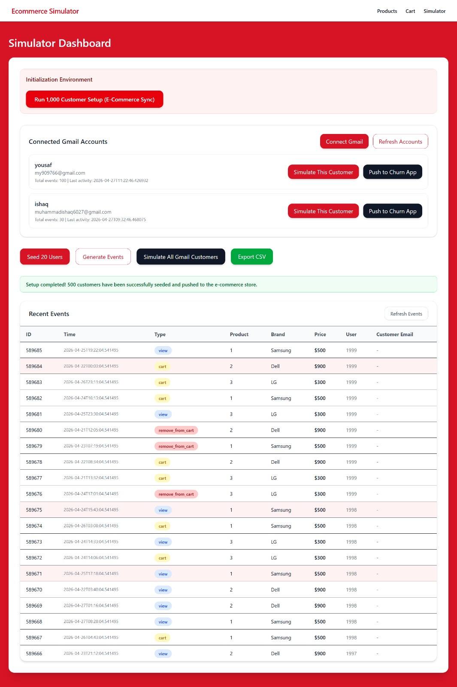

# Churn Guard E-commerce Simulator

Churn Guard E-commerce Simulator is a **synthetic event generation** project for **customer churn prediction** in e-commerce.  
It generates realistic user interaction data so you can build and test churn models, retention strategies, and data pipelines.


---

## 🔍 Motivation

Real e-commerce customer data is private and hard to access.  
This simulator helps you:

- Prototype churn prediction models without real customer data
- Experiment with different behavior patterns and retention strategies
- Test ETL / data pipelines and dashboards safely

---

## ✨ Features

- Generate synthetic events: sessions, page views, carts, purchases, inactivity
- Label users as churned vs active (depending on your logic)
- Configurable parameters: number of users, time period, behavior intensity
- Export data to CSV/JSON for ML and analytics
- Easy to extend with new event types or business rules


---

## 🛠️ Tech Stack

- **Language:** Python
- **Typical libraries:** (update based on your `requirements.txt`)
  - `pandas` for data frames
  - `numpy` for numerical operations
  - `faker` or custom logic for synthetic data
  - `scikit-learn` (optional) for simple churn models or examples
- **Environment:** Local Python, virtualenv or conda, or Google Colab

---

## 📦 Installation

1. Clone the repository:

```bash
git clone https://github.com/yousafnasar/churn-guard-ecommerce-simulator.git
cd churn-guard-ecommerce-simulator
```

2. Create and activate a virtual environment (recommended):

```bash
python -m venv venv
# Windows
venv\Scripts\activate
# macOS / Linux
source venv/bin/activate
```

3. Install dependencies:

```bash
pip install -r requirements.txt
```

---

## ▶️ Usage

Basic run (adjust to your script name and arguments):

```bash
python simulate.py
```

Example with arguments:

```bash
python simulate.py \
    --num-users 1000 \
    --days 90 \
    --output data/events.csv
```

Explain here what each argument does:

- `--num-users` – number of unique users to simulate  
- `--days` – number of historical days to simulate  
- `--output` – path to the generated dataset file  

If you use a config file (like `config.yaml`), document it here.

---

## 📁 Project Structure

Update this to match your repo:

```text
churn-guard-ecommerce-simulator/
├── src/                    # Core simulation code
│   ├── generators/         # Event/user generators
│   ├── utils/              # Helper functions
│   └── __init__.py
├── data/                   # Generated datasets (usually gitignored)
├── images/                 # Screenshots & diagrams used in README
│   ├── overview.png
│   ├── workflow.png
│   └── output.png
├── notebooks/              # Experiments / EDA / model training
├── simulate.py             # Main entry point to run simulation
├── requirements.txt        # Python dependencies
└── README.md               # Project documentation
```

---

## 📊 Example Output

Describe the output file and show a small preview:

- File: `data/events.csv`
- Columns: `user_id`, `event_type`, `timestamp`, `session_id`, `amount`, `is_churned`, etc.

```text
user_id,event_type,timestamp,session_id,amount,is_churned
12,view_product,2025-01-01 10:15:23,abc123,0,0
12,add_to_cart,2025-01-01 10:17:10,abc123,0,0
12,checkout,2025-01-01 10:20:45,abc123,39.99,0
57,session_start,2025-02-10 08:01:03,xyz789,0,1
...
```



---

## 🔬 Typical Workflow

1. Generate synthetic dataset with this simulator.
2. Load it in a notebook or script (e.g., `notebooks/churn_model.ipynb`).
3. Engineer features like RFM, session frequency, recency.
4. Train churn models (logistic regression, tree-based models, etc.).
5. Evaluate and iterate on simulator parameters.

---

## 🤝 Contributing

Contributions are welcome:

- Open an issue for bugs, feature requests, or ideas.
- Fork the repo and create a pull request with your changes.
- Keep code style consistent and add brief docstrings/comments.

---

## 📜 License

Specify your license here (e.g., **MIT License**).  
If you don’t have one yet, create a `LICENSE` file and mention it here.

---

## 👤 Author

**Muhammad Yousaf**  
Computer Science student and developer focusing on **ML, churn prediction, and web development**.  
GitHub: [@yousafnasar](https://github.com/yousafnasar)